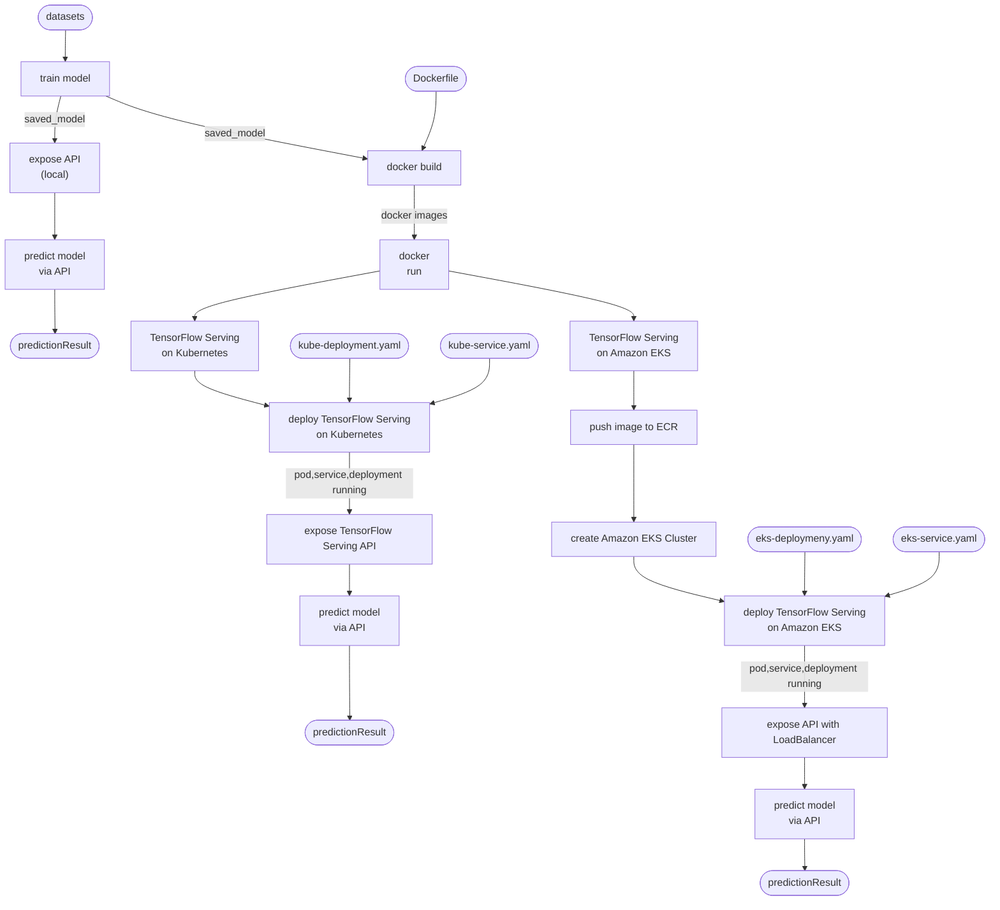

**Machine Learning - Zoomcamp**
# E-Commerce Engagement Prediction Model

---

## Project Overview

This project aims to predict the engagement of tweets related to several e-commerce companies. Engagement is defined as a combination of likes, replies, and retweets. The model processes input text (preprocessed tweets) and hashtag information to output an engagement score that reflects the potential audience interaction.

The project implements TensorFlow Serving, Docker, Kubernetes, and Amazon Elastic Kubernetes Service (EKS) for efficient model deployment and scalability, as well as Streamlit API for interactive prediction serving.

---

## Table of Contents

- Project Overview

- Features and Target

- Objective

- Technologies Used

- Dataset

- Tasks Flow

- EDA & Notebooks

- Model
  
- Repository Structures

- Deployment Architecture

- How to Run the Project

- Future Improvements

- Acknowledgments

---

## Features and Target

### Features

- Clean_tweet: Preprocessed version of the tweet text (lowercased, tokenized, and cleaned).
- Hashtags: Count or presence of hashtags in the tweet

### Target

**Engagement**: A continuous value representing the combination of likes, replies, and retweets.

---

## Objective

The primary objectives of this project are to:

- Predict the engagement score of a given tweet based on its content and hashtags.

- Deploy the model with TensorFlow Serving for real-time predictions.

- Containerize the application using Docker.

- Orchestrate the deployment with Kubernetes and scale it on Amazon EKS for production-level operations.

---

## Technologies Used

The project integrates the following technologies:

- Hadoop Distributed File System (HDFS): Used for storing data.
- Pandas: For data processing.
- PySpark: For distributed data processing.
- TensorFlow: For building and saving the deep learning model.
- Streamlit API: Used to create an API for serving predictions.
- Docker: Containerizes the TensorFlow model.
- TensorFlow Serving: Provides optimized model serving for real-time predictions.
- Kubernetes: Orchestrates containers for scaling and deployment.
- Amazon EKS: A managed Kubernetes service for cloud-based deployment.

--- 

## Dataset

Dataset header: **Indonesia's Top E-Commerce Tweets**

Dataset link: [https://www.kaggle.com/datasets/robertvici/indonesia-top-ecommerce-unicorn-tweets](https://www.kaggle.com/datasets/robertvici/indonesia-top-ecommerce-unicorn-tweets)

[Dataset content](https://github.com/ketut-garjita/E-Commerce-Engagement/blob/main/images/dataset-content.png) 


**About Dataset**

This dataset contains the tweets from the first tweet until April 2020 of top e-commerce unicorn in Indonesia namely Shopee, Tokopedia, Bukalapak, Lazada and Blibli.

The dataset consists of tweets about an associated engagement metrics. 

Each data point includes:
- Tweet text
- Number of hashtags
- Engagement value (target)

Preprocessing includes:
- Text cleaning: Removing punctuation, special characters, and links.
- Tokenization: Splitting text into tokens.

---

## Tasks Flow

Model deployment of TensorFlow Serving on Local, Kubernetes and Amazon EKS.



---


##  EDA & Notebooks

- EDA (Exploratory Data Analysis) can be viewed in [EDA.ipynb](https://github.com/ketut-garjita/E-Commerce-Engagement/blob/main/notebook/src/EDA.ipynb)

- Additional notebooks are available in [notebook.ipynb](https://github.com/ketut-garjita/E-Commerce-Engagement/blob/main/notebook/src/notebook.ipynb)

---


## Model

The project uses a deep learning model built using Keras to predict the engagement score. The model is then exported for TensorFlow Serving.

Steps:

- Train and save the model in TensorFlow SavedModel format.
- Use TensorFlow Serving to serve the model.
- Create a Streamlit API to send input to TensorFlow Serving and return predictions.

---

## Repository Structures

   ```
   ├── README.md                                # Documentation for the project
   ├── config                                   # Configuration files
   │   ├── kube-deployment.yaml                 # Kubernetes deployment configuration
   │   ├── kube-service.yaml                    # Kubernetes service configuration
   │   ├── eks-deployment.yaml                  # Amazon EKS deployment configuration
   │   └── eks-service.yaml                     # Amazon EKS service configuration
   ├── notebook                                 # Notebook purposes
   │   ├── models                               # keras model and pre-configured tokenizer
   │   ├── saved_model/1                        # final model
   │   └── src
   │       ├── notebook.ipynb                   # Notebook for testing data, showing schema, etc
   │       ├── EDA.ipynb                        # Notebokk for Explatory Data Analisys
   │       ├── train_model_pandas.ipynb         # train model with pandas
   │       └── train_model_pyspark.ipynb        # train model with pyspark
   ├── kubectl-apply.md                         # Kubernetes deployment and service commands
   ├── Dockerfile                               # Instructions to containerize the application
   ├── requirements.txt                         # Package Dependencies
   ├── src                                      # Code (python or py scripts)
   │   ├── train_model.py                       # train model
   │   ├── app.py                               # api script copied to docker image
   │   ├── predict_model_streamlit.py           # predict model without Container
   │   ├── serve_input_kube_streamlit.py        # predict model with Kubernets
   │   └── serve_input_eks_streamlit.py         # predict model with Amazon EKS
   ├── models
   │     ├── E-Commerce-Engagement_model.keras  # Saved machine learning model built with Keras, TensorFlow’s high-level API for building and training neural networks
   │     └── tokenizer.pkl                      # To store a pre-trained or pre-configured tokenizer.
   └── saved_model/1                            # Final saved model for TensorFlow Serving
        ├── variables                           # Trained weights and biases.
        │   ├── variables.data-00000-of-00001   # The actual numerical data for all the TensorFlow variables (e.g., weights, biases, etc.).
        │   └── variables.index                 # An index file that helps TensorFlow locate variables in the data file
        ├── fingerprint.pb                      # Metadata for version tracking.
        └── saved_model.pb                      # Model graph definition, including input-output signatures.
   
   ```

---

## Deployment Architecture


The project follows a microservices deployment architecture:

- **Model Deployment**

   - The trained Keras model is exported in TensorFlow SavedModel format.

   - TensorFlow Serving hosts the model and provides an endpoint for predictions.

- **API Deployment**

   - The Streamlit app is containerized using Docker.

   - A Streamlit application sends requests to TensorFlow Serving and returns predictions to clients.

- **Kubernetes Orchestration**

   - TensorFlow Serving containers are orchestrated using Kubernetes.

   - Kubernetes can be deployed locally or on Amazon EKS for scalability.

- **Amazon EKS Deployment**

   - Amazon Elastic Kubernetes Service (EKS) is used for production-level deployment and scaling.

---

## How to Run the Project

### Prerequisites

Ensure you have the following installed:

- Python 3.12
- Kaggle account and local authorization setup
- AWS account and local authorization & CLI setup
- TensorFlow/Keras
- Docker
- Kubernetes
- kubectl
- kind
- Linux Hadoop for option train the model using pyspark tool

### Steps

#### **STEP 1: Clone this repository**
  
   ```
   git clone https://github.com/ketut-garjita/E-Commerce-Engagement.git
   ```   

#### **STEP 2: Train Model (optional)**

   If you want to train model, follow [train-model.md](https://github.com/ketut-garjita/E-Commerce-Engagement/blob/main/train-model.md)

   - Tokenizer: [models/tokenizer.pkl](https://github.com/ketut-garjita/E-Commerce-Engagement/tree/main/models) directory

   - Model result for local prediction: [models/e-commerce-engagement-model](https://github.com/ketut-garjita/E-Commerce-Engagement/tree/main/models) directory

   - Final model for prediction on docker: [saved_model/1/](https://github.com/ketut-garjita/E-Commerce-Engagement/tree/main/saved_model/1) directory

     
#### **STEP 3: Predict the Model**

   **Without Container**

   - Run the Streamlit API

      ```
      cd E-Commerce-Engagement/src
      streamlit run predict_model_streamlit.py          
      ```
   
   - Test model prediction via Streamlit API

     [http://localhost:8501](http://localhost:8501)

     [E-Commerce Angagement Prediction - Local](https://github.com/ketut-garjita/E-Commerce-Engagement/blob/main/images/prediction-local.png)

     


   **With Container**

  - Docker Images and Containers

    - [Dockerfile](https://github.com/ketut-garjita/E-Commerce-Engagement/blob/main/Dockerfile)
    - [docker-compose.yaml](https://github.com/ketut-garjita/E-Commerce-Engagement/blob/main/docker-compose.yaml)
    - Docker Images:
      - tensorflow/serving
      - e-commerce-engagement-streamlit-api
    - Docker Containers:
      - tf-serving
      - streamlit-api
    - Once docker images and containers built, we can start or stop containers using commands:
      - docker start f-serving streamlit-api
      - docker stop f-serving streamlit-api

  - Build docker images and run containers

     ```
     docker compose up --build          
     ```
  - Review Containers
    ```
    docker ps
    ```    

  - Test the Model Prediction

    [http://localhost:8501](http://localhost:8501)

    [E-Commerce Angagement Prediction - Docker](https://github.com/ketut-garjita/E-Commerce-Engagement/blob/main/images/prediction-docker.png)

    


#### **STEP 4: Deployment**

##### Deploy TensorFlow Serving on **Kubernetes**

- Prerequisites
    
  ```
  # Install kind
  curl -Lo ./kind https://kind.sigs.k8s.io/dl/latest/kind-linux-amd64
  chmod +x ./kind
  sudo mv ./kind /usr/local/bin/kind
  
  # Verify kind
  kind version
  
  # Install kubectl
  curl -LO "https://dl.k8s.io/release/$(curl -L -s https://dl.k8s.io/release/stable.txt)/bin/linux/amd64/kubectl"
  chmod +x kubectl
  sudo mv kubectl /usr/local/bin/kubectl
  
  # Verify kubectl
  kubectl version --client
  
  # Start Cluster
  kind create cluster
    Creating cluster "kind" ...
     ✓ Ensuring node image (kindest/node:v1.32.0) 🖼 
     ✓ Preparing nodes 📦  
     ✓ Writing configuration 📜 
     ✓ Starting control-plane 🕹️ 
     ✓ Installing CNI 🔌 
     ✓ Installing StorageClass 💾 
    Set kubectl context to "kind-kind"
    You can now use your cluster with:        
    kubectl cluster-info --context kind-kind        
    Not sure what to do next? 😅  Check out https://kind.sigs.k8s.io/docs/user/quick-start/
  
  # Edit ~/.bashrc and add line:
  export KUBECONFIG=~/.kube/config

  source ~/.bashrc         
  ```

- Tag e-commerce-engagement-streamlit-api:latest to e-commerce-engagement-streamlit-api:v1
    
   ```
   docker tag e-commerce-engagement-streamlit-api:latest e-commerce-engagement-streamlit-api:v1     
   ```
     
 - Register docker image with kind

   ```
   kind load docker-image e-commerce-engagement-streamlit-api:latest
   OR
   kind load docker-image e-commerce-engagement-streamlit-api:v1    
   ```

- Apply deployment and service
    
   ```
   kubectl apply -f config/kube-deployment.yaml
   kubectl apply -f config/kube-service.yaml   
   ```
    
 - Check status
    
   ```
   kubectl get pod

      NAME                                          READY   STATUS    RESTARTS   AGE
      tf-serving-engagement-model-8b8ccc9c5-f46jz   1/1     Running   0          122m     
   ```
   The pod should be Ready (1/1) and Status (Running).
    
   ```
   kubectl get all              
   ```
  
 - Predict Model

   ```
   cd E-Commerce-Engagement/src
   streamlit run serve_input_kube_streamlit.py    
   ```

   http://localhost:8501/ will open automatically on browser.

   


  
  ##### Deploy TensorFlow Serving on **Amazon EKS**
  
   - Authenticate Docker to AWS ECR, use the AWS CLI to authenticate Docker client
     
     ```
     aws ecr get-login-password --region <AWS Region> | docker login --username AWS --password-stdin <AWS Account ID>.dkr.ecr.<AWS Region>.amazonaws.com      
     ```
           
   - Create repository
     
     ```
     aws ecr create-repository --repository-name e-commerce-engagement-streamlit-api     
     ```
           
   - Tag image to AWS
     
      ```
      docker tag e-commerce-engagement-streamlit-api <AWS Account ID>.dkr.ecr.<AWS Region>.amazonaws.com/e-commerce-engagement-streamlit-api:latest      
      ```
          
   - Push image
     
      ```
      docker push <AWS Account ID>.dkr.ecr.<AWS Region>.amazonaws.com/e-commerce-engagement-streamlit-api:latest      
      ```
          
   - Configure AWS CLI and EKS
     
      ```
      aws configure  
      ```
          
   - Create Amazon EKS Cluster
     
      ```
      eksctl create cluster \
        --name tf-serving-cluster \
        --region <AWS Region> \
        --nodegroup-name tf-serving-nodes \
        --nodes 2 \
        --node-type t3.medium \
        --managed       
      ```
          
   - Deploy container to AWS
     
     ```
     kubectl apply -f config/eks-deployment.yaml
     kubectl apply -f config/eks-service.yaml     
     ```
           
   - Check nodes
     
     ```
     kubectl get nodes      
     ```
           
   - Check all status (pod, services, deployment)
     
     ```
     kubectl get all      
     ```
     
   - Predict Model

     ```
     cd E-Commerce-Engagement/src
     streamlit run serve_input_eks_streamlit.py   
     ```
          
---

## Future Improvements

- This model was trained using the Indonesian language, as most of the text in the dataset is in Indonesian. In the future, training the model with multilingual data (English and Indonesian) could improve its ability to handle both languages.

- The VM machine cannot utilize the GPU on the host machine, so the model training process relies entirely on the CPU. To accelerate model training, it is recommended to utilize cloud-based resources.

- Incorporate additional features such as posting time and user follower count.

- Use Transformers for improved text understanding.

- Integrate real-time tweet analysis pipelines using Kafka and Spark Streaming.

- Optimize the Amazon EKS deployment for autoscaling and cost efficiency.
 
---

## Acknowledgments

Tools: HDFS, Pandas, Pyspark, Numpy, TensorFlow Serving, Streamlit API, Docker, Kubernetes, Amazon EKS.

Dataset: [Indonesia's Top E-Commerce Tweets](https://www.kaggle.com/datasets/robertvici/indonesia-top-ecommerce-unicorn-tweets)

---
# E-Commerce-Engagement
